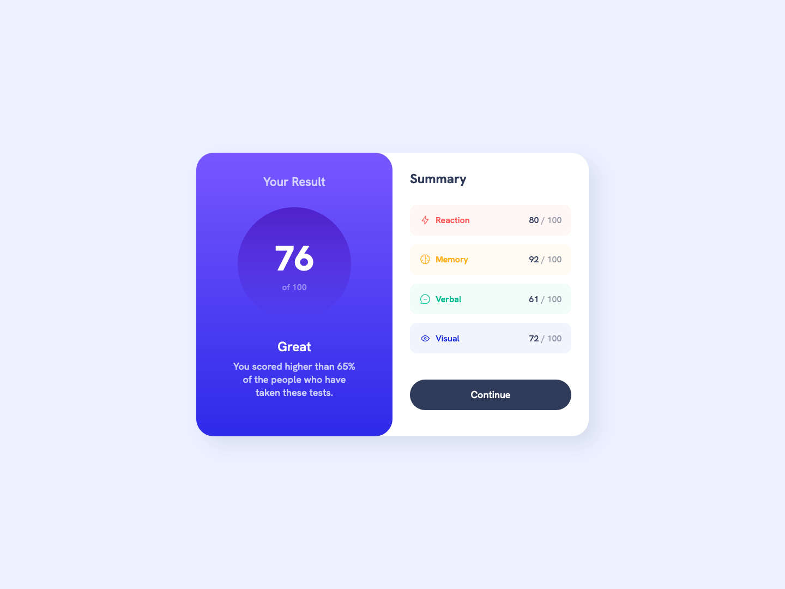
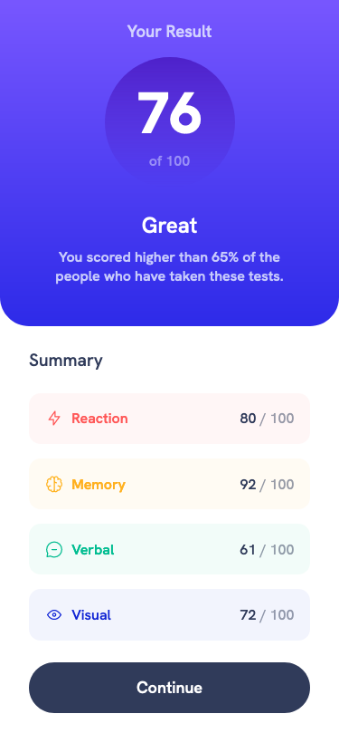

# Frontend Mentor - Results summary component solution

This is a solution to the [Results summary component challenge on Frontend Mentor](https://www.frontendmentor.io/challenges/results-summary-component-CE_K6s0maV). Frontend Mentor challenges help you improve your coding skills by building realistic projects.

## Table of contents

- [Overview](#overview)
    - [The challenge](#the-challenge)
    - [Screenshot](#screenshot)
- [My process](#my-process)
    - [Built with](#built-with)
    - [What I learned](#what-i-learned)
    - [Continued development](#continued-development)
    - [Useful resources](#useful-resources)
- [Author](#author)
- [Acknowledgments](#acknowledgments)

**Note: Delete this note and update the table of contents based on what sections you keep.**

## Overview

### The challenge

Users should be able to:

- View the optimal layout for the interface depending on their device's screen size
- See hover and focus states for all interactive elements on the page

### Screenshot




## My process

### Built with

- HTML5
- CSS
- Flexbox
- CSS Grid
- Mobile-first workflow

### What I learned

I took this project as an opportunity to explore the use of css grids deeper than I have before. Typically, I use flexbox for as much styling as possible but this time I used flex for centering the div, the different stats-cards under the summary, etc.

```css
main {
  background-color: hsl(221, 100%, 96%);
  min-height: 100vh;
  display: grid;
  place-items: center;
}

.container {
  width: 100%;
  min-height: 100vh;
  display: grid;
  background-color: white;
}
```
So basically learned a method for centering a div with css grids.

### Continued development

In future projects I would like to continue focusing on using css grids for layouting since I tend to avoid it in favor of flexbox. Not because I have anything against css grids but because I'm more comfortable with flexbox.

GOAL: Get more comfortable with css grids.

### Useful resources

As per usual when writing css, MDN docs helped me out a lot. :)

## Author

- Website - [Sixten Peterson](https://snicon.rip)
- Frontend Mentor - [@Snicon](https://www.frontendmentor.io/profile/Snicon)